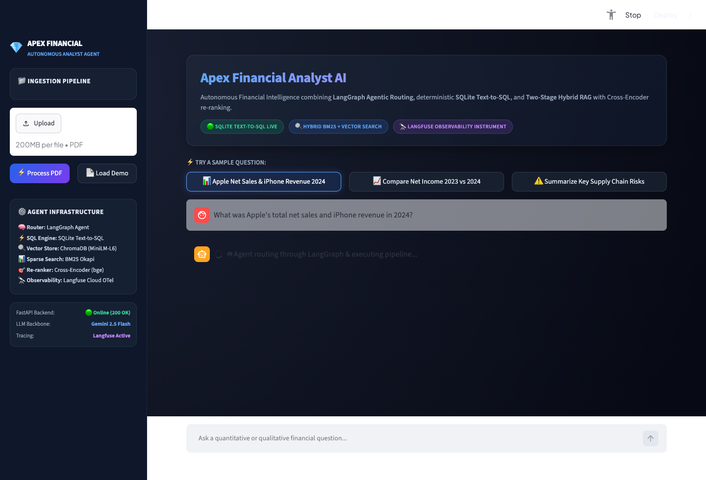
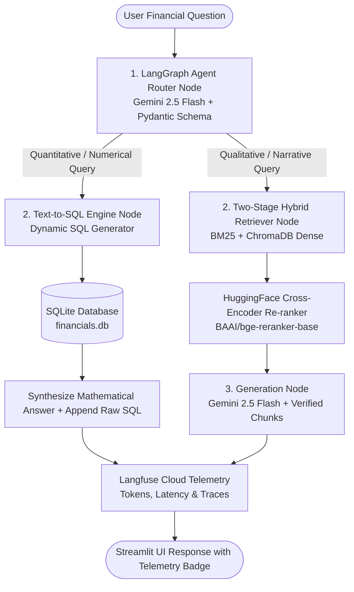

# Apex Financial Analyst AI 📈💎


An enterprise-grade, **Compound AI & Autonomous Financial Analyst Agent** designed for deep quantitative and qualitative analysis over corporate earnings reports and SEC 10-K filings. 

Combines **LangGraph Agentic Routing**, deterministic **SQLite Text-to-SQL**, a **Two-Stage Hybrid RAG pipeline (BM25 + ChromaDB + Cross-Encoder Re-ranking)**, and real-time **Langfuse OpenTelemetry Observability**.

---

## 📸 Interface Preview



*Enterprise Glassmorphism Interface featuring real-time telemetry badges, query routing indicators, dynamic prompt chips, and integrated document processing.*

---

## 🏛️ System Architecture

Standard naive RAG systems fail when applied to corporate finance because they treat qualitative disclosures (e.g. supply chain risks) and quantitative line items (e.g. exact net income or gross margin) with the same fuzzy vector search—often leading to hallucinated figures.

**Apex Financial AI solves this by decoupling qualitative text synthesis from deterministic quantitative arithmetic:**



---

## ⚡ Key Architectural Capabilities

### 1. 🧠 LangGraph Agentic Router (`app/router.py` & `app/graph.py`)
- Models the reasoning workflow as a **State Machine** with discrete nodes and conditional edges.
- Uses **Gemini 2.5 Flash** with **Pydantic Structured Outputs** (`RouteQuery`) to evaluate query intent at temperature `0.0`.
- Deterministically routes numerical questions to SQLite and strategic/risk questions to the Hybrid Retriever.

### 2. 🗄️ Deterministic Text-to-SQL Engine (`app/sql_engine.py`)
- Translates natural language requests into mathematically verified SQLite `SELECT` queries over structured financial statements (e.g., `financial_metrics`, `segment_revenue`).
- Strict security guardrails: enforces read-only operations and prevents SQL injection.
- Guaranteed **zero hallucination** on exact earnings figures, EPS, and category revenues.

### 3. 🔍 Two-Stage Hybrid Search Pipeline (`app/hybrid_retriever.py`)
- **Stage 1 (Sparse / Lexical):** **BM25 Okapi** indexes exact terminology, ticker symbols, and specific legal phrases often blurred by embeddings.
- **Stage 1 (Dense / Semantic):** **ChromaDB** using `all-MiniLM-L6-v2` maps paragraphs to 384-dimensional dense vectors with **HNSW indexing**.
- **Stage 2 (Deep Re-Ranking):** Evaluates candidate chunks using a local **Cross-Encoder model (`BAAI/bge-reranker-base`)**, performing full cross-attention between query and chunk to filter candidates down to the top 3 highest-precision chunks.

### 4. 🔭 Production Observability & Tracing (`app/observability.py`)
- Native integration with **Langfuse Cloud** via OpenTelemetry standards.
- Every chat request records:
  - Token consumption & calculated inference cost ($).
  - Step-by-step latency profiling (Router vs Retrieval vs Re-ranking vs Synthesis).
  - Trace context session IDs and user attribution.

---

## 🛠️ Tech Stack & Trade-off Analysis

| Layer | Technology Used | Industry Alternatives Considered | Why This Technology Was Selected |
| :--- | :--- | :--- | :--- |
| **Agent Orchestration** | **LangGraph** | LangChain Classic, CrewAI, AutoGen | Provides stateful, deterministic graph control with conditional branching instead of rigid linear chains or unpredictable multi-agent chat loops. |
| **Vector Database** | **ChromaDB** | Pinecone, Milvus, Weaviate | Lightweight in-process vector engine with HNSW indexing, zero SaaS cloud costs, and fast local persistence. |
| **Sparse Retrieval** | **Rank-BM25** | Elasticsearch, OpenSearch | In-memory token scoring with document length normalization without the 4GB+ RAM overhead of dedicated JVM search clusters. |
| **Re-Ranking** | **Cross-Encoder** (`bge-reranker-base`) | Cohere Rerank API, ColBERT | Local HuggingFace inference ensuring complete data privacy, zero external API costs, and high precision. |
| **LLM Reasoning** | **Google Gemini 2.5 Flash** | GPT-4o, Claude 3.5 Sonnet, Llama 3 | Industry-leading speed (~500ms TTFT), 1M token context window, native Pydantic structured output support, and cost efficiency. |
| **Relational DB** | **SQLite (`sqlite3`)** | PostgreSQL, MySQL, Pandas | Serverless, single-file ACID compliance for financial statements without remote code execution risks associated with `eval()` on Pandas. |
| **Observability** | **Langfuse** | Arize Phoenix, LangSmith, W&B Weave | Open-source core with dedicated RAG evaluation capabilities, trace visualization, and real-time token cost accounting. |
| **Backend API** | **FastAPI + Uvicorn** | Flask, Django, Express.js | High-performance asynchronous ASGI architecture with automated OpenAPI documentation. |
| **Frontend UI** | **Streamlit** | Next.js/React, Gradio | Rapid development of an enterprise dark glassmorphism dashboard with reactive telemetry badges and session management. |

---

## 📈 Scalability Blueprint (Enterprise Migration Path)

For deployments scaling to **10,000+ corporate users and 5M+ SEC filings**:

1. **Vector Storage:** Migrate ChromaDB to a horizontally sharded **Qdrant** or **Milvus cluster** partitioned by `tenant_id` and stock ticker.
2. **Lexical Search:** Transition Rank-BM25 to a multi-node **Amazon OpenSearch** cluster for distributed indexing.
3. **Re-Ranking Compute:** Decouple CPU re-ranking to a dedicated GPU microservice running **NVIDIA Triton Inference Server** with dynamic batching and TensorRT-LLM quantization (reducing latency from 400ms to 15ms).
4. **Relational Database:** Migrate SQLite to **AWS Aurora PostgreSQL Serverless** with **PgBouncer** connection pooling.
5. **Semantic Caching:** Deploy a **Redis Semantic Cache** (GPTCache) to serve repeated financial queries in under 10ms at $0 token cost.
6. **Container Orchestration:** Deploy stateless FastAPI pods on **AWS EKS (Kubernetes)** with Horizontal Pod Autoscaling (HPA) behind an Application Load Balancer.

---

## 🚀 Quick Start Guide

### 1. Clone the Repository
```bash
git clone https://github.com/shahidbaig-shaik/advanced-financial-rag.git
cd advanced-financial-rag
```

### 2. Set Up Virtual Environment & Dependencies
```bash
python3.13 -m venv venv
source venv/bin/activate
pip install -r requirements.txt
```

### 3. Configure Environment Variables
Create a `.env` file in the project root:
```env
GEMINI_API_KEY="your_gemini_api_key"
CHROMA_PERSIST_DIR="./chroma_db"
CHUNK_SIZE=500
CHUNK_OVERLAP=50

# Langfuse Observability (free cloud tier: https://cloud.langfuse.com)
LANGFUSE_PUBLIC_KEY="pk-lf-..."
LANGFUSE_SECRET_KEY="sk-lf-..."
LANGFUSE_BASE_URL="https://us.cloud.langfuse.com"
```

### 4. Launch Application
Run the automated boot script to start both the FastAPI backend (port 8001) and Streamlit UI (port 8502):
```bash
chmod +x run.sh
./run.sh
```

### 5. Access the Dashboard
Open your browser at **`http://localhost:8502`**. Click **"📄 Load Demo"** in the sidebar to index the included Apple FY2024 10-K report and begin querying!

---

## 🧪 Sample Prompts

- **Quantitative (Tests Text-to-SQL Engine):**
  - *"What was Apple's total net sales and iPhone revenue in 2024?"*
  - *"Compare Apple's net income between 2023 and 2024."*
  - *"What was the diluted earnings per share (EPS) in fiscal year 2024?"*

- **Qualitative (Tests Hybrid RAG + Cross-Encoder):**
  - *"What are the primary geopolitical and supply chain risks in the Asia-Pacific region?"*
  - *"How much did Apple spend on R&D in FY 2024, and what was the strategic focus regarding Apple Intelligence?"*
